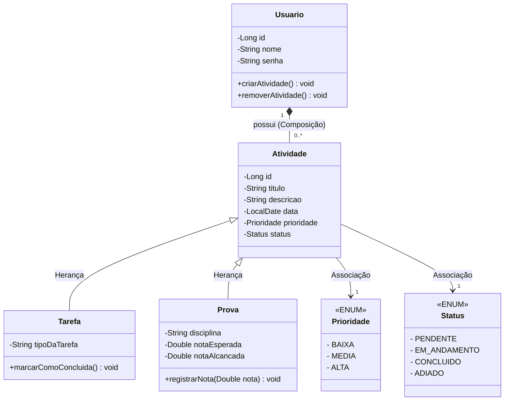

# SPRINT 2 - MODELAGEM DE CLASSES E RELACIONAMENTOS

## 1. Objetivo da Sprint

O objetivo desta entrega é definir a estrutura inicial do sistema através do diagrama de classes. Foram definidas as classes do domínio, seus respectivos atributos e métodos, além dos relacionamentos entre elas. As decisões foram baseadas nos conceitos de orientação a objetos apresentados na disciplina de Engenharia de Software.

## 2. Diagrama de Classes

Abaixo apresentamos o modelo estrutural do sistema.

## 3. Definição das Classes e Atributos

* **Classe Usuario:** Esta classe representa a pessoa que utiliza o sistema. Ela guarda os dados principais como `id`, `nome` e `senha`. Adicionamos os métodos de criar e remover atividades.
* **Classe Atividade:** Esta é uma classe mãe e abstrata. Ela foi criada para armazenar os atributos em comum (`id`, `titulo`, `descricao`, `data`, `prioridade`, `status`). Sendo abstrata, o sistema não instanciará uma "atividade" genérica, apenas seus tipos específicos.
* **Classe Tarefa:** Esta classe representa as tarefas de estudo normais. Ela possui o atributo específico `tipoDaTarefa`.
* **Classe Prova:** Esta classe representa as avaliações do usuário. Ela possui atributos próprios que uma tarefa comum não tem, como a `disciplina` e as notas.
* **Classes de Enumeração (Prioridade e Status):** Foram criadas para padronizar as informações. O status da atividade só pode ser um dos valores definidos no Enum, evitando que palavras incorretas sejam salvas no sistema.

## 4. Explicação dos Relacionamentos e Justificativas de Modelagem

Para estruturar o sistema corretamente, aplicamos os conceitos de relacionamento vistos na aula de Engenharia de Software:

* **Herança (Generalização/Especialização):**
Foi aplicada a herança da superclasse `Atividade` para as subclasses `Tarefa` e `Prova`.
**Justificativa:** Nós utilizamos a herança para evitar a repetição de código. Se não houvesse a herança, teríamos que escrever os atributos de título, data, prioridade e status duas vezes (uma vez dentro de Tarefa e outra dentro de Prova). Assim, as subclasses herdam tudo da classe mãe e adicionam apenas os seus atributos específicos.
* **Composição:**
Existe um relacionamento de composição entre `Usuario` e `Atividade` (representado pelo losango preenchido).
**Justificativa:** A composição foi escolhida porque a parte (Atividade) depende do todo (Usuário) para existir. Uma tarefa não faz sentido no sistema se não pertencer a um usuário. Se o registro do usuário for removido do banco de dados, todas as suas atividades deverão ser excluídas obrigatoriamente.
* **Associação Simples:**
A classe `Atividade` se relaciona com os Enums `Status` e `Prioridade` através de uma associação.
**Justificativa:** Foi aplicada a associação porque a atividade possui e necessita de um status e de uma prioridade para estar completa. É uma ligação estrutural para que a classe Atividade consiga acessar os valores padronizados na enumeração.
